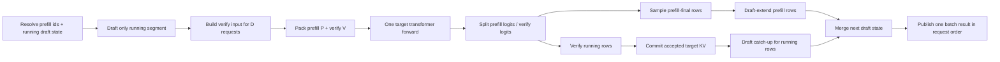

# SGLang MTP + Mixed Chunk 详细设计

- 状态：P0 Triton-first 纵向切片、P1 Breakable CUDA Graph 与 FA3 MHA 首版已闭环。FA3 复用同一 composition contract，在自身 `forward_extend()` 内按 prefill/verify 双 metadata 执行；FlashInfer/MLA 等其他 backend 尚未实现
- 基线：SGLang `b95a74694842b0540c4682d94add777a5c2feeda`
- 参考：TokenSpeed main `7b65d67f937716489d5435d0f8e14a5e12cc2eb9`
- 目标硬件：单卡 RTX 4090 24 GB，Qwen3 MHA + Triton 作为首个可验证 backend

## 1. 决策摘要

本方案分两阶段交付。

第一阶段（P0）优先修改 scheduler 和 attention backend，并同时提交单测：

1. scheduler 能把 chunked prefill 与线性链 MTP verify 放入同一个逻辑 iteration；
2. 计算预算按 `prefill_tokens + verify_requests * verify_width` 计费；
3. target KV、draft 辅助状态、workspace 分别按各自资源模型计费，不能拿 `D*K` 代替 KV reserve；当前 SGLang EAGLE draft 与 target 共用 request locator/allocator 时只收一次物理 KV reserve，不能重复扣费；
4. target 模型的 token-major buffer 使用稳定布局 `[prefill tokens][verify tokens]`；
5. Transformer 的 embedding、QKV、MLP 对 packed buffer 一次执行；每层 attention 在 backend 内按 segment 切成 prefill 与 verify 两次 kernel 调用，再写回同一输出 buffer；
6. logits、sampling、accept、target KV commit、draft catch-up 按 request segment 分流；
7. mixed iteration 首版走 eager，纯 prefill、纯 verify 继续使用现有 CUDA Graph，overlap scheduler 保持开启。

第二阶段（P1）已经接入 CUDA Graph：复用 SGLang 已有 Breakable Prefill CUDA Graph（BCG），按总 token bucket 捕获 token-shaped 主干，让 attention 保持 eager break；Full/tc-piecewise 对 composition 仍 fail/fallback，只有 BCG 无法达到目标时才评估专用 mixed full graph。

不建议第一版增加永久的 `ForwardMode.MIXED_TARGET_VERIFY`。`MIXED` 表示“存在多个执行 segment”，具体语义由显式 composition metadata 描述，避免所有 model/backend 复制新的枚举分支。

## 2. TokenSpeed 中值得复用的处理思路

TokenSpeed 的关键不是某一个融合 kernel，而是四个清晰的系统边界：

- scheduler 先生成一个 forward plan，并将 request 稳定排列为 prefill 在前、decode 在后；
- speculative decode 的 input width 已经是 verify window，而不是普通 decode 的 1 token；
- executor 使用 `[ragged prefill][D*K verify]` 的 token 布局，logits 对 prefill 只保留每请求最后一行，对 verify 保留整个 window；
- MLA backend 同时初始化 prefill metadata 和 decode/verify metadata，每层 attention 分段执行；drafter 再根据 accept length 衔接下一轮。

需要注意两个差异：

1. TokenSpeed 当前 mixed speculative 主路径主要落在 MLA backend；其通用 MHA backend 仍显式拒绝 mixed batch。因此本方案借鉴的是控制流和 metadata 边界，不能直接照搬一个现成 MHA 实现。
2. TokenSpeed 的 prefill graph 是 breakable graph：token-shaped 主干被 capture，attention 读取 replay 时的 live metadata 并在 break 中执行。这与 SGLang 当前已有的 Breakable Prefill CUDA Graph 架构相似，适合作为二阶段基础。

## 3. 基线阻塞点与本轮处理

### 3.1 参数层

- 基线的 `speculative_hook.py::_handle_eagle_family()` 会把 `enable_mixed_chunk` 强制改为 `False`；
- 基线的 `server_args.py` 断言 speculative decoding 与 mixed chunk 不可同时启用，且错误消息写成了相反的 “required”。

本轮只对 EAGLE/EAGLE3、单 GPU、target Triton、topk=1 的实验配置放开；其他组合继续自动关闭或参数 fail-fast。

### 3.2 Scheduler

原始基线的普通 mixed chunk：

```text
PrefillAdder(..., num_mixed_decode_tokens=running_bs)
running_batch.prepare_for_decode()
new_batch.mix_with_running(running_batch)
```

这隐含了“每个 running request 只执行 1 个 decode token”。MTP target verify 的 query width 是 `K`，计算 token 应为 `D*K`。此外，原字段 `num_mixed_decode_tokens` 同时影响：

- `rem_input_tokens/rem_chunk_tokens`：计算预算；
- `rem_total_token_offset`：KV 内存预算。

两种预算在 speculative decoding 下不相等。本轮已将其拆为 `mixed_compute_tokens` 和 `mixed_kv_reserve_tokens`，后者由 allocator 估算；spec mixed worker/result commit 已在窄配置闭环。

### 3.3 Spec worker

`EAGLEWorkerV2.forward_batch_generation()` 看到 `batch.forward_mode.is_extend()` 就走“整批 target prefill + 整批 draft prefill”。普通 `MIXED` 也被 `is_extend()` 包含，因此它不会对 running segment 执行 draft + target verify。

### 3.4 Triton backend

Triton 当前 `ForwardMetadata` 也是按单一模式构造：

- ordinary extend 构造 prefill 的 `qo_indptr/kv_indptr/kv_indices`；
- target verify 根据 verify width、spec info 和 custom mask 构造另一组 metadata；
- `forward_extend()` 每次只读取一个 `self.forward_metadata`。

P0 因此在 Triton backend 内增加 composite metadata：分别保存 prefill 与 verify 的现有 `ForwardMetadata`，每层按 token offset 切分 Q/K/V 并分别调用已有 extend/verify kernel。首版不修改 Triton kernel 数学实现。

当前实现不再 snapshot/clone metadata。backend 维护两个 ring slot；每个 slot 有一份 `int32[2,max_bs+1]` 和 `int64[4,max_bs+1]` arena，prefill/verify 分别取得不相交的 row view。`kv_indices` 使用每 slot 一个 grow-only、2 的幂扩容 arena，再切成两个 segment view。metadata builder 接收显式 `ForwardMetadataScratch`，不递归调用初始化函数，也不临时切换 `self.forward_metadata`。attention 输出同样只分配一个 parent buffer，两个 kernel 写入 `[:P]` 与 `[P:]` view，已删除结果 `torch.cat`。

两个 ring slot 避免下一轮 planning 立即覆盖上一轮 attention 尚在读取的 storage；slot 内首个 indptr 元素永久为零。CPU pinned staging 不复用这一 GPU arena，仍由每 step 独立 staging/既有生命周期管理，避免异步 H2D 与下一轮 CPU 填充竞争。

### 3.5 CUDA Graph

SGLang 已有：

- decode/target-verify CUDA Graph；
- prefill CUDA Graph；
- Breakable CUDA Graph backend，attention 可以作为 eager break；
- prefill runner 已能将普通 `MIXED` 归一化为 captured `EXTEND`。

因此二阶段不应先新增 `(P_bucket, D_bucket, K)` 的完整笛卡尔积 graph。更经济的路径是让现有 BCG 携带 composition metadata，并继续以总 token bucket 捕获主干。

## 4. 范围

### 4.1 第一阶段支持范围

- 单 GPU；
- centralized serving，非 PD disaggregation；
- Qwen3 类 MHA target；
- target prefill/decode/verify backend 均为 Triton；
- 线性链 speculative verify：`topk=1`；
- 固定 verify width `K=speculative_num_draft_tokens`；
- MTP/NEXTN/EAGLE-family 共用的 chain-verify composition；
- greedy 和常规 sampling；
- overlap scheduler 保持开启；
- mixed iteration eager，纯路径 graph 不变。

P0 验证服务显式固定：

```text
--attention-backend triton
--speculative-draft-attention-backend triton
--speculative-attention-mode prefill
```

由于 prefill/decode 都解析为同一个 Triton backend，`speculative-attention-mode` 不改变 kernel 选择；仍显式写出它，保证后续引入分离 backend 时测试配置没有隐式默认变化。

首轮实现以 EAGLE3 模型做 4090 实测，是因为本机已有可用权重；composition、scheduler 和 Triton backend 不依赖 EAGLE3 tree 语义，验收时必须再加入一个真正的 topk=1 MTP/NEXTN 模型。

### 4.2 第一阶段明确 fail-fast

- `topk > 1` 的 EAGLE tree；
- ragged verify width；
- FROZEN_KV_MTP；
- DFLASH/DSPARK；
- DP attention、TP/PP 多卡；
- PD disaggregation；
- multimodal/input embeds；
- LoRA mixed batch；
- return input logprob；
- hybrid linear attention/Mamba state；
- encoder-decoder/cross attention；
- HiCache load-in-progress 和 retraction recovery batch。

fail-fast 必须发生在参数解析或 scheduler capability gate，不能进入 backend 后才 assert 或产生错误 KV。

### 4.3 第二阶段范围

- Breakable Prefill CUDA Graph 支持 mixed composition；
- 4090 上的 bucket、padding 与显存调优；
- 通过后再逐项打开 topk>1、ragged verify、多卡、MLA、hybrid linear attention。

## 5. 核心不变量

以下不变量应写成 assertions，并在单测中逐项覆盖。

### 5.1 布局不变量

令：

- `E`：prefill request 数；
- `P`：prefill token 总数；
- `D`：verify request 数；
- `K_i`：第 i 个 verify request 的 query width；首版固定为 `K`；
- `V=sum(K_i)`：verify token 总数。

request 布局：

```text
[prefill req 0 ... E-1][verify req 0 ... D-1]
```

token 布局：

```text
[ragged prefill tokens: 0 ... P-1][request-major verify tokens: P ... P+V-1]
```

必须满足：

```text
batch_size == E + D
num_tokens == P + V
verify_token_offset == P
len(verify_req_pool_indices) == D
sum(verify_q_lens) == V
```

任何 filter、abort、retract、DP padding 都不能破坏 prefill-first 的稳定顺序。

### 5.2 预算不变量

```text
compute_charge = P + V
target_kv_reserve = target allocator/page accounting
draft_aux_reserve = algorithm-specific accounting
```

`draft_aux_reserve` 是逻辑账本，不代表一定存在第二个 allocator。当前 SGLang EAGLE draft 复用 target 的 request pool 与 token locator，draft KV buffer 以同一虚拟位置寻址，因此 target allocation 已覆盖位置 reserve；该实现通常返回 0 个“额外 locator token”，只校验 draft pool 的几何和容量。独立 draft allocator 的实现才扣第二份物理 reserve；FROZEN_KV_MTP 则没有 draft KV reserve。

禁止：

```text
target_kv_reserve = D*K
draft_aux_reserve = D*K
```

因为 target 最终只 commit accepted path，allocator 还受到 page 对齐、已有预分配、overlap double-buffer 的影响。

### 5.3 状态不变量

- prefill request 的 target KV commit 数等于当前 chunk 实际 token 数；
- verify request 的 target KV commit 数等于 accepted tokens（含 bonus 的现有 SGLang 口径）；
- rejected verify slot 被释放或保留为 allocator 明确管理的 reserve，不能进入 req-to-token committed table；
- draft KV/hidden state 在 catch-up 后与 target 的 accepted frontier 对齐；
- mid-chunk prefill 不生成可被下一轮 verify 消费的候选；last-chunk prefill 才进入正常 speculative decode frontier；
- mixed iteration 结束后，未完成 prefill 与 running decode 都回到正确队列，不允许把 running batch 清空后丢失所有权。

## 6. 数据结构设计

### 6.1 `ForwardComposition`

建议在 `python/sglang/srt/model_executor/forward_batch_info.py` 增加算法无关的执行描述：

```python
@dataclass(slots=True)
class ForwardSegment:
    request_offset: int
    request_count: int
    token_offset: int
    token_count: int


@dataclass(slots=True)
class ForwardComposition:
    kind: Literal["prefill_spec_verify"]
    prefill: ForwardSegment
    verify: ForwardSegment
    verify_q_lens: torch.Tensor       # int32, shape [D]
    verify_q_lens_cpu: list[int]
    verify_positions: torch.Tensor    # shape [V]
    verify_input_ids: torch.Tensor    # shape [V]
    verify_spec_info: SpecInput       # only covers D verify requests
```

`ScheduleBatch` 对应保存一个 host-side `SpecMixedPlan`，`ForwardBatch.init_new()` 才把它物化为 device tensors。不要把 GPU tensor 放进 scheduler admission object。

### 6.2 `SpecMixedPlan`

建议新增 `python/sglang/srt/managers/scheduler_components/spec_mixed_chunk.py`：

```python
@dataclass(slots=True)
class SpecMixedPlan:
    prefill_req_count: int
    verify_req_count: int
    prefill_token_count: int
    verify_q_lens: list[int]
    verify_compute_tokens: int
    target_kv_reserve_tokens: int
    draft_aux_reserve_tokens: int
    policy_reason: str
    generation: int
```

其中 `generation` 用于检测 overlap 下 FutureMap payload 是否属于当前 request slot 的最新一代，避免 abort + slot reuse 读到旧候选。

### 6.3 Backend capability

在 `base_attn_backend.py` 增加窄接口：

```python
def supports_forward_composition(self, kind: str, *, topk: int, fixed_q_len: int) -> bool:
    return False
```

Triton MHA 首版返回：

```text
kind=prefill_spec_verify
topk=1
fixed_q_len>0
无 SWA/cross-attn/DCP/score_mod
```

参数 hook 只能在 target backend、draft worker 和 scheduler 都声明 capability 后保留 `enable_mixed_chunk=True`。

## 7. 第一阶段 P0：Scheduler 设计

### 7.1 拆分 PrefillAdder 的双账本

`schedule_policy.py::PrefillAdder` 已改为：

```python
PrefillAdder(
    ...,
    mixed_compute_tokens=0,
    mixed_target_kv_reserve_tokens=0,
)
```

处理规则：

```text
rem_input_tokens -= mixed_compute_tokens
rem_chunk_tokens -= mixed_compute_tokens
rem_total_token_offset += mixed_target_kv_reserve_tokens
cur_rem_token_offset += mixed_target_kv_reserve_tokens
```

普通 non-spec mixed 也迁移到新接口：

- compute 通常为 `D`；
- KV reserve 使用 `new_tokens_required_next_decode()`，而不是假定为 `D`。

这样重构可先单独合入，行为在 page size 1、无预分配时保持一致。

### 7.2 生成 admission snapshot

在 `Scheduler.get_new_batch_prefill()` 开头、创建 `PrefillAdder` 前：

1. `running_batch.filter_batch()`；
2. 过滤 finished/abort/recovery 不可混请求；
3. 从 spec runtime 得到固定 `K`；
4. 计算 `V=D*K`；
5. 调用 `running_batch.new_tokens_required_next_decode()` 得到 target reserve；
6. 查询 spec worker 的只读 `estimate_draft_aux_reserve(running_batch)`；共享 locator 的 EAGLE 路径返回 0 额外 token并执行容量校验，不能把 target reserve重复扣一次；
7. capability/policy 通过后创建不可变 snapshot。

伪代码：

```python
admission = spec_mixed_planner.plan(
    running_batch=running_batch,
    waiting_queue=self.waiting_queue,
    prefill_budget=self.max_prefill_tokens,
    chunk_budget=chunked_prefill_size,
    target_available=allocator.available_size(),
    draft_aux_budget=spec_worker.draft_aux_budget(),
)
```

如果任何检查失败，返回 `None`，沿用当前纯 prefill/纯 verify 路径。

### 7.3 chunk 缩减

当 `chunk_budget=C` 时：

```text
prefill_budget_after_verify = C - V
```

- 若 `prefill_budget_after_verify >= page_size`，将 prefill chunk 缩小到该值并按 page 对齐；
- 若不足一页，但 running decode 已超过 SLO，则本轮只跑 pure verify；
- 若 decode 未超 SLO，则本轮只跑 pure prefill；
- 不允许为命中 mixed 强行安排 0-token prefill segment。

示例：`C=512,D=24,K=4,page=1`，prefill 最多 416 token，而不是继续安排 512 后再追加 96 token。

这比把总 forward 扩大到 608 token 更能控制 TTFT 和显存峰值。为了对比 TokenSpeed 的“总预算内混合”与“chunk 固定、额外追加”两种策略，telemetry 应同时记录未缩减的候选 P。

### 7.4 两阶段 commit，禁止半构造 batch

调度采用 prepare/commit：

```text
PLAN
  只读计算 compute/KV/workspace/capability
PREPARE
  admission prefill、分配 req slot、构造 prefill batch
  为 running view 执行 spec_prepare_for_decode 和 reserve
COMMIT
  构造 SpecMixedPlan，稳定 merge，更新队列所有权
ROLLBACK
  任一分配失败时释放本轮新分配、恢复 req 字段和队列
```

现有 `prepare_for_decode()` 会修改 `decode_batch_idx`、KV allocation、seq lens 等状态，不能先对完整 running batch调用、再在 merge 失败后简单丢弃。建议给 spec prepare 增加 `SpecDecodeReservation` 返回值：

```python
reservation = prepare_spec_decode_reservation(running_view)
reservation.commit()
reservation.rollback()
```

如果第一版改造成本过大，可限制 PREPARE 顺序为“prefill admission 全部成功后再 prepare running”，并对 prepare 失败回退 pure verify；但仍需对新增 target allocation 提供显式 rollback 测试。

### 7.5 新的 merge，而不是复用 `mix_with_running()`

新增：

```python
new_batch.mix_with_spec_running(running_batch, plan)
```

它与普通 `mix_with_running()` 的差异：

- running request 的 extend length 是 `K`，不是 1；
- input ids 暂不在 scheduler 构造，worker draft 完成后才物化 verify candidates；
- `spec_info` 对 prefill 与 verify segment 分开；
- `out_cache_loc` 的 verify 部分覆盖全部 speculative reserve/window；
- `decoding_reqs` 只指向 verify segment；
- 保存 `prefill_reqs`、`verify_reqs` 和 segment offsets；
- merge 完成后 running batch 的所有权转入 mixed batch，失败前不得清空原 running batch。

### 7.6 FutureMap/overlap

当前 mixed 普通 decode 通过 `mix_running_indices` 延迟读取 output token。spec mixed 需要：

```text
prefill_input_ids_cpu -> prefill segment
FutureMap RelayPayload -> verify segment 的 EagleDraftInput
```

新增 `mix_spec_running_indices`，`resolve_forward_inputs()` 按两个 segment 分别解析，不将 draft payload 错配给 prefill request。解析时校验：

- request pool index；
- generation；
- payload 宽度/topk；
- batch 中 verify request 顺序。

### 7.7 调度策略

首个工程版本提供：

```text
--spec-mixed-chunk-policy off|always|slo
```

- 默认 `off`；
- correctness/benchmark 使用 `always`；
- 性能稳定后将 `slo` 作为候选默认值。

SLO 策略至少维护：

```text
age_since_last_verify_ms
consecutive_prefill_passes
predicted_prefill_ms(P)
predicted_verify_ms(D,K)
mixed_padding_ratio
```

触发条件：

```text
age + predicted_prefill >= target_tpot_slo
OR consecutive_prefill_passes >= max_prefill_passes
```

第一阶段 cost model 可以使用分桶 EWMA，不需要引入复杂回归模型。

## 8. 第一阶段 P0：Triton Backend 设计

### 8.1 Composite metadata

新增：

```python
@dataclass
class CompositePrefillVerifyMetadata:
    prefill: ForwardMetadata
    verify: ForwardMetadata
    prefill_num_tokens: int
    verify_num_tokens: int
```

`TritonAttnBackend.init_forward_metadata()` 新增最高优先级分支：

```python
if forward_batch.composition is not None:
    self.forward_composition_metadata = (
        self._init_composite_prefill_verify_metadata(forward_batch)
    )
elif decode ...
elif target_verify ...
else extend ...
```

不能让 composition 落入 ordinary extend 分支，因为 ordinary extend 会把 verify window 当成新的 ragged prompt，并使用错误的 prefix/mask。

### 8.2 Metadata view

不要复制完整 token tensor。为两个 segment 构造 view：

```text
prefill req view:
  req_pool_indices[:E]
  seq_lens[:E]
  extend_prefix_lens[:E]
  extend_seq_lens[:E]
  out_cache_loc[:P]

verify req view:
  req_pool_indices[E:E+D]
  seq_lens[E:E+D]
  verify_q_lens[D]
  verify positions/input ids from verify_spec_info
  out_cache_loc[P:P+V]
```

metadata builder 不复制 kernel 实现，而是复用现有两个初始化分支。建议先把当前函数拆成无状态 helper：

```python
_build_extend_metadata(prefill_view) -> ForwardMetadata
_build_target_verify_metadata(verify_view) -> ForwardMetadata
```

普通路径也调用这两个 helper；composition 路径同时保存两个返回值。传给 verify helper 的 request tensors 必须已经切到 D 行，`spec_info` 必须是 verify-only view。

实际实现已将单模式逻辑下沉到 `_build_forward_metadata(forward_batch, scratch)`：composition 为两段传入显式 scratch view，pure path 传 `None` 并保持原有 buffer 语义。这里没有递归初始化、metadata snapshot、tensor clone 或 `self.forward_metadata` 临时切换。首版仅接受 fixed q len；如果 verify token 数不能按 verify batch size 整除，capability gate 返回 false。

### 8.3 每层 attention

`forward_extend()` 识别 composite metadata。为了复用现有实现，将当前单 metadata kernel dispatch 下沉为：

```python
_forward_extend_with_metadata(q, k, v, ..., metadata, segment_batch)
```

组合入口执行：

```python
P = metadata.prefill_num_tokens

q_prefill, q_verify = q[:P], q[P:]
k_prefill, k_verify = k[:P], k[P:]
v_prefill, v_verify = v[:P], v[P:]

prefill_view = output[:P]
verify_view = output[P:]

forward_extend_with_active_metadata(
    q_prefill, k_prefill, v_prefill, metadata.prefill, prefill_view
)
forward_extend_with_active_metadata(
    q_verify, k_verify, v_verify, metadata.verify, verify_view
)
return output
```

这里是“两次 attention kernel + 一次 packed Transformer layer”，不是把两种 attention 强行融合成一个 kernel。主要收益来自：

- embedding/QKV/O-proj/MLP 对 `P+V` 一次 launch；
- 不再把一个 prefill target forward 和一个小 verify target forward 串行调度；
- running decode 每个 chunk 都得到 verify 机会。

P0 选择按 segment 各写一次 KV：prefill helper 只接收 `out_cache_loc[:P]`，verify helper 只接收 `out_cache_loc[P:P+V]`。这会多一次 store 调用，但边界最清晰，也能直接与 sequential baseline 做 KV parity。确认 packed loc 与 K/V 同序后再优化成一次整段 store。

### 8.4 Verify mask 隔离

必须保证：

- verify request 之间不可互相注意；
- verify token 不可注意 prefill segment 的 token；
- verify token 只能访问自身已提交 prefix 和允许的 draft ancestor；
- prefill causal mask 不读取 verify segment。

两个 Triton metadata 和两次 kernel dispatch 天然把 request 空间分开，但 custom mask、`qo_indptr/kv_indptr/kv_indices` 仍需测试。禁止为了减少一次 kernel 而构造一个全局 block mask 的 mega-prefill kernel作为首版。

### 8.5 P0 限制与后续 backend

首版 capability 应拒绝：

- sliding window；
- cross attention；
- DCP/context parallel；
- deterministic unified extend 特殊路径；
- `score_mod/aux_tensors`；
- multimodal。

接口稳定后，适配顺序建议为 FA3、FlashInfer、MLA。FA3 同样采用 dual metadata + segment dispatch；FlashInfer 再处理双 wrapper plan。每打开一项必须同时增加 metadata parity 和 KV parity 测试。

## 9. Worker/Executor 闭环

虽然 scheduler/backend 是 P0 优先项，但没有 worker 的结果分流，mixed forward 不能正确提交，因此必须与 P0 同一个 feature branch 完成。

### 9.1 Mixed worker 流程

在 `EAGLEWorkerV2.forward_batch_generation()` 最前增加：

```python
if batch.spec_mixed_plan is not None:
    return self.forward_batch_spec_mixed(batch, ...)
```

执行序列：



当前 SGLang 的 draft 在 target verify 之前运行，因此第一阶段保留该顺序；不要求像 TokenSpeed 一样重排为 target 后统一 draft。重排可作为后续独立优化，避免一次功能改造同时改变 speculative pipeline 时序。

### 9.2 ForwardBatch pack

新增纯函数：

```python
pack_prefill_and_verify_forward(
    prefill_forward_batch,
    verify_forward_batch,
) -> ForwardBatch
```

它负责：

- concatenate input ids、positions、out cache loc；
- request-level tensors concatenate；
- attach `ForwardComposition`；
- sampling info 保持 request order；
- `capture_hidden_mode=FULL`；
- `spec_info` 不再直接指向 verify input，而是由 composition 持有 verify-only spec_info；
- `forward_mode=MIXED`。

pack 函数不得修改两个输入 view，便于 eager parity 单测逐段执行后比较。

### 9.3 Logits 分流

设模型输出 token rows 为 `P+V`：

- prefill：按 `extend_start_loc + extend_seq_lens - 1` gather E 个 last-token logits；
- verify：保留 `[P:P+V]`，reshape 为 `[D,K,...]` 或交给现有 tree verify layout；
- prefill 中 mid-chunk request 不对用户输出 token，只更新 KV/draft prefill state；
- last-chunk prefill request 正常 sample bonus token；
- verify 使用现有 `run_eagle_verify()`，accept index 必须减去/加上正确 token offset，不能把 prefill offset传给 KV move kernel。

建议先返回结构化结果：

```python
MixedTargetOutput(
    prefill_logits_output,
    verify_logits_output,
    packed_hidden_states,
)
```

不要让 sampling backend 根据 magic row count 自行猜 segment。

### 9.4 KV commit

target：

- prefill segment 沿用 extend commit；
- verify segment 调用现有 `move_accept_tokens_to_target_kvcache()`，传入 verify-local `out_cache_loc` view；
- verify reject slot 的释放沿用 allocator 现有 reserve 生命周期；
- 更新每个 request 的 `kv_committed_len` 后断言不超过 `kv_allocated_len`。

draft：

- running rows走现有 `_draft_extend_for_decode()`；
- final prefill rows走现有 `_draft_extend_for_prefill()`；
- mid-chunk rows只推进 draft prefill KV，不发布下一轮 candidates；
- 合并后的 `next_draft_input` 按完整 request order重排，不能按 GPU completion order。

### 9.5 输出和统计

`GenerationBatchResult` 增加 segment-aware 字段或内部 sidecar：

```text
prefill_req_count
verify_req_count
verify_accept_lengths
mixed_target_num_tokens
mixed_forward_elapsed_ms
```

外部 API 仍返回原 request 顺序，不暴露内部 segment。

## 10. 错误处理与回退

以下条件在 scheduler 阶段回退 pure path：

- backend capability false；
- `V >= chunk_budget`；
- target reserve 或 draft auxiliary capacity 不足；
- FutureMap payload generation 不一致；
- 存在第一阶段不支持的 request feature；
- chunked request 正处于 load/recovery/retraction；
- mixed padding/cost model 超阈值。

以下条件属于编程错误，必须 assert/fail-fast，不能静默回退：

- composition token count 与 tensor shape 不一致；
- verify q lens 与 spec_info 不一致；
- KV write loc 数与 K/V 行数不一致；
- accept index 越过 verify-local window；
- request segment 顺序改变；
- commit length 大于 allocated length。

CUDA error 后不尝试在同一进程回退，因为 CUDA context 可能已经损坏。

## 11. 配置与可观测性

新增参数建议：

```text
--spec-mixed-chunk-policy off|always|slo       default=off
--spec-mixed-target-tpot-ms FLOAT              default unset
--spec-mixed-max-prefill-passes INT            default=1
--spec-mixed-max-verify-ratio FLOAT             default=0.25
```

现有 `--enable-mixed-chunk` 继续作为总开关；spec policy 未显式设置时，即使打开普通 mixed，也不自动打开 speculative mixed，直到实验完成。

每轮指标：

```text
sglang_spec_mixed_attempt_total
sglang_spec_mixed_admit_total{reason}
sglang_spec_mixed_fallback_total{reason}
sglang_spec_mixed_prefill_tokens
sglang_spec_mixed_verify_tokens
sglang_spec_mixed_target_kv_reserve
sglang_spec_mixed_draft_aux_reserve
sglang_spec_mixed_accept_length
sglang_spec_mixed_forward_ms
sglang_spec_mixed_padding_ratio
sglang_spec_mixed_graph_hit
sglang_decode_age_since_verify_ms
```

NVTX：

```text
spec_mixed/draft
spec_mixed/pack
spec_mixed/target
spec_mixed/attn_prefill
spec_mixed/attn_verify
spec_mixed/sample_prefill
spec_mixed/verify
spec_mixed/draft_catchup
```

## 12. 单测设计

单测必须随对应代码 PR 提交，不能留到 CUDA Graph 阶段补。

### 12.1 Scheduler CPU 单测

新增 `test/registered/unit/managers/test_spec_mixed_chunk_planner.py`：

1. `test_compute_budget_uses_d_times_k`
   - `D=8,K=4,C=512`；断言 mixed compute charge 为 32，不是 8。
2. `test_chunk_shrinks_after_verify_charge`
   - 断言 prefill chunk 从 512 缩为 480。
3. `test_zero_prefill_budget_falls_back_to_verify`
   - `D*K >= C` 时不构造 0-token mixed batch。
4. `test_target_kv_reserve_uses_allocator_estimate`
   - 构造已有预分配和 page size 16；断言 reserve 不等于 `D*K`。
5. `test_draft_aux_accounting_does_not_double_charge_shared_allocator`
   - EAGLE 共享 locator 时只扣 target reserve；再用 fake 独立 draft pool验证 auxiliary capacity 不足时回退。
6. `test_finished_and_aborted_rows_are_filtered_before_layout`
7. `test_stable_prefill_then_verify_request_order`
8. `test_topk_gt_one_is_rejected_by_capability`
9. `test_ragged_q_lens_rejected_in_phase_one`
10. `test_return_logprob_and_input_embeds_fall_back`
11. `test_age_slo_forces_verify_when_prefill_would_violate_tpot`
12. `test_light_load_keeps_pure_graph_path`
13. `test_future_payload_generation_mismatch_falls_back`
14. `test_plan_does_not_mutate_running_batch`

扩展 `test/registered/scheduler/test_mixed_chunked_prefill.py`：

15. 一条 long chunked prefill + N 条 running MTP 的 batch 序列；逐 iteration 检查 request 不丢失；
16. 两个连续 mixed iteration 的 seq lens/kv committed continuity；
17. mid-chunk、last-chunk 转换；
18. abort 一个 verify request 后下一轮 offsets 重算；
19. prefill admission 失败时 running batch 仍可 pure verify；
20. reservation rollback 后 available size 恢复。

扩展 `test/registered/unit/managers/test_scheduler_decision_batch_params.py`：

21. 参数默认关闭；
22. backend capability false 时 hook 不放开；
23. server args 中矛盾的 assert message 修正并测试。

### 12.2 Composition/ForwardBatch 单测

当前 contract、pack/logits split、shared-output view、arena reuse、capability/backend dispatch 测试位于 `test/registered/unit/model_executor/test_forward_composition.py`；scheduler accounting 与 overlap child 生命周期测试分别位于 `test_prefill_adder.py` 和 `test_schedule_batch_out_of_place.py`。以下 fail-fast/filter 场景仍需继续补齐：

1. `[P][V]` input ids、positions、out cache loc 精确拼接；
2. request tensors `[E][D]` 精确拼接；
3. ragged prefill last-logit gather indices；
4. verify-local indices 不含 prefill offset；
5. pack 不修改源 ForwardBatch；
6. empty prefill/empty verify 退化到 pure path；
7. shape mismatch fail-fast；
8. FutureMap 只填 verify segment；
9. filter 后 composition 重建而不是原位截断。

### 12.3 Triton backend 单测

当前 CPU 测试已覆盖 capability gate、双段共享 arena view、grow-only KV-index arena、token segment dispatch、单输出 buffer 与异常后的状态恢复。metadata builder 还应使用 fake pool/backend state 补齐：

1. prefill updater 只收到前 E 个 request；
2. verify updater 只收到后 D 个 request；
3. prefill qo indptr 等于 ragged chunk cumsum；
4. verify qo indptr 等于 `[0,K,2K,...,D*K]`；
5. page table request 行无交叉；
6. prefill/verify out cache loc token offsets正确；
7. custom verify mask不包含 prefill token；
8. capability 对 topk/ragged/SWA/cross-attn/DCP/deterministic path 返回正确结果；
9. zero-length segment 不启动非法 Triton kernel；
10. metadata 对象在下一 batch 不读取旧 offsets。

仍需新增 GPU 单测 `test/registered/attention/test_triton_spec_mixed.py`：

11. mixed eager hidden output与“同输入下 sequential prefill + target verify”逐元素接近；
12. logits parity；
13. target KV cache parity；
14. accept=0、accept=1、accept=K 的 commit parity；
15. poisoned prefill rows不影响 verify output；
16. poisoned verify rows不影响 prefill output；
17. page size 1 和 16；
18. 重复 100 iterations 后无 KV leak、无 illegal access。

建议容差：BF16 hidden/logits `rtol=2e-2, atol=2e-2`，greedy token 必须完全相同。当前真实 E2E 三请求 hash 对比有两个发生分叉，正说明不能简单以“服务未崩溃”替代该 GPU parity 测试；必须记录首个分叉 token 的 packed/sequential logits、top-2 margin、attention 输出误差与 KV row parity，再判断是合法的 GEMM 数值路径差异还是实现错误。

### 12.4 Worker 单测

新增 `test/registered/unit/spec/test_eagle_worker_v2_mixed.py`：

1. draft 只接收 verify segment；
2. target forward 只调用一次；
3. verify input width 为 K；
4. prefill sample 与 verify accept 分流；
5. mid-chunk prefill不发布 candidate；
6. final prefill正确加入 next draft state；
7. running draft catch-up使用 accepted length；
8. merged next draft input按完整 request order；
9. grammar/unsupported feature在 worker 前已被 gate；
10. overlap on/off 结果一致。

### 12.5 端到端测试

扩展 `test/manual/chunked_prefill/test_e2e_spec.py`，并在稳定后注册一组小模型 CI：

- mixed off/on greedy token parity；
- prefix cache hit；
- EOS 位于第 1、K 个候选；
- request abort；
- retraction 后重新 prefill；
- 1 个 long prefill + 1/8/24 decode；
- 连续到达的 long prompt；
- 服务 10 分钟无显存单调增长。

## 13. 第一阶段性能验收

使用现有 cache-flushed 基线相同的模型、prompt、seed、并发和输出长度：

| 输入/输出 | 并发 |
|---|---:|
| 128/128 | 1, 8, 24 |
| 1024/128 | 1, 8, 24 |
| 4096/128 | 1, 8, 24 |

每个 case 至少 3 次，报告 median 和离散度。必须输出：

- output/total throughput；
- mean/p50/p90/p99 TTFT；
- mean/p50/p90/p99 TPOT；
- p99/max ITL；
- accept length；
- mixed admission/fallback ratio；
- target forward GPU time；
- attention prefill/verify GPU time；
- graph hit rate；
- peak allocated/reserved GPU memory。

第一阶段通过线：

- correctness 全通过；
- 128/128 c24 输出吞吐回退不超过 5%；
- 4096/128 c24 p99 ITL 至少下降 40%，目标 50%；
- 4096/128 c24 mean TPOT 至少下降 20%，目标 25%；
- total throughput 回退不超过 5%；
- mean TTFT 回退不超过 10%；
- 无 KV leak、无 request starvation。

若 eager mixed 达到尾延迟目标但吞吐回退超过 5%，保留 `slo` policy，仅在预计 TPOT 违约时启用；不要把 `always` 设为默认。

## 14. 第二阶段 P1：CUDA Graph

### 14.1 首选 Breakable Prefill CUDA Graph

SGLang 当前 prefill BCG 已按总 token bucket 捕获 Transformer 主干，并把 attention 作为 eager break。mixed composition 最适合沿用这一结构：

```text
captured segment: embedding / norm / QKV / MLP / projection
eager break:      composite Triton prefill attention + verify attention
captured segment: next transformer body segment
eager tail:       logits demux / sampling / verify commit
```

Graph key 首版仍是：

```text
total_token_bucket = ceil_bucket(P + V)
capture_hidden_mode = FULL
model/backend variant
```

不把 D、K 加入 graph key，因为 attention 在 eager break读取 live composition；K 只影响总 token 数和 live metadata。只有某个 captured op 的 shape真正依赖 request count/K 时，才扩展 `ShapeKey.variant_label`。

### 14.2 BCG 需要修改的点

`PrefillCudaGraphRunner`：

- `can_replay_locally()` 接受 composition，但首版只允许 supported fixed-K；
- `load_batch()` 将 composition 的 token offsets、request offsets、verify q lens复制到 address-stable buffers；
- ordinary `MIXED -> EXTEND` mode normalization 保留，但 composition 不能丢失；
- `_prefill_logits_buffer_rows()` 返回 `E+V` 所需行数，不能只按普通 prefill E 行；
- padded token 行写 dummy KV slot、dummy token、zero position；
- padding 不得进入 verify accept/sampling。

`CudaGraphBufferRegistry`：新增 slots：

```text
composition_offsets[4]
verify_q_lens[max_bs]
verify_positions[max_verify_tokens]
verify_valid_token_mask[max_bucket]
```

Triton backend：

- capture 时创建 pointer-stable 的两组 `ForwardMetadata` buffer 和 attention workspace；
- replay 前 out-of-graph 原位刷新 prefill/verify indptr、indices、mask 和 token offsets；
- attention break读取当前真实 P/E/D/V；
- 不在 replay 内调用 `.item()`、动态分配或 D2H。

### 14.3 bucket 建议

4090 24 GB 初始只捕获当前 prefill ladder 中不超过 608 token 的 bucket，重点覆盖：

```text
128, 256, 384, 512, 640
```

若采用“总预算 512 内缩小 prefill”，主要命中 512；640 只用于对照“不缩 chunk、额外追加 verify”。最终以 profiler 决定保留项，不预先捕获 `P×D×K` 全组合。

### 14.4 CUDA Graph 单测

新增 `test/registered/unit/model_executor/test_prefill_cuda_graph_spec_mixed.py`：

1. composition 在 `MIXED -> EXTEND` normalize 后仍存在；
2. 同一 bucket 内不同 `(P,D)` replay parity；
3. padding 行 poison 后不改变真实输出；
4. verify valid mask阻止 padding被 accept；
5. graph replay 前 metadata 原位刷新、地址不变；
6. graph miss正确 eager fallback；
7. pure prefill -> mixed -> pure prefill 连续 replay无 stale metadata；
8. mixed -> pure verify decode graph切换无 stale buffer；
9. 1000 次 replay显存稳定；
10. capture/replay期间无动态 CUDA allocation；
11. target hidden/logits/KV 与 eager mixed parity；
12. graph hit/fallback metrics正确。

### 14.5 CUDA Graph 验收

在第一阶段验收基础上：

- mixed graph hit rate >= 80%（4096/128 c24）；
- 相对 eager mixed，output throughput 提升 >= 8% 或 target mixed forward GPU/host wall time下降 >= 10%；
- p99 ITL 不回退超过 5%；
- graph 额外显存可控，24 GB 卡启动后仍保留至少 1 GB 安全余量；
- pure-path graph 性能无回退。

若 BCG 的收益不足，不直接扩大 bucket。先用 Nsight Systems 判断瓶颈是 attention eager break、host plan、draft，还是 captured GEMM；只有确认 full graph 能消除主要瓶颈后才设计专用 mixed graph。

## 15. 理论收益与风险

本机基线 `P=512,K=4,D<=24`：

```text
V/P = D*K/P
D=12 -> 9.4%
D=19 -> 14.8%
D=24 -> 18.75%
```

packed forward 没有消除这部分算术量。收益来自：

- 每个 prefill chunk 至少给 running request 一次 verify，消除连续 prefill 导致的秒级 ITL 空洞；
- 小 verify batch 与 prefill 共用 token-shaped GEMM，提高 GPU 占用并减少 launch；
- scheduler 不再在 prefill/verify 两个互斥状态间产生气泡。

主要风险：

- verify token 挤占 prefill chunk，TTFT 可能上升；
- 两个 attention kernel仍是串行的，attention 占比高时吞吐收益有限；
- packed batch shape改变 GEMM 数值次序，sampling 边界 token可能变化；
- overlap 下 FutureMap/slot reuse 是正确性高风险点；
- page size、double-buffer、accept/reject 使 KV reserve 远比 `D*K` 复杂；
- BCG padding可能吞掉融合收益。

因此上线目标优先级应为：正确性 > p99 ITL/TPOT > output throughput > TTFT；不能只看 total token throughput。

### 15.1 实测反馈对 scheduler 的重新设计

同一 Triton backend、同一 4090、4096/128 c24 下，always-mix eager 相对 separated：

```text
output throughput: 258.6 -> 214.9 tok/s   (-16.9%)
mean TTFT:          4849.0 -> 6227.1 ms    (+28.4%)
mean TPOT:          39.33 -> 28.99 ms      (-26.3%)
p99 ITL:            936.5 -> 74.6 ms       (-92.0%)
max ITL:            3413.5 -> 79.9 ms      (-97.7%)
accept length:      2.99 -> 2.02
```

这证明 mixed 解决的是 decode starvation，但 always-mix 把过多 eager 成本和 verify 计算插入 prefill，且当前 packed 数值路径使接受长度下降。下一轮 scheduler 不应继续优化“混合次数”，而应优化“用最少 mixed 次数守住 TPOT SLO”：

1. 轻载、短 prompt、`age_since_last_verify` 仍有余量时保持 pure graph；128/128 c24 不应进入 mixed eager。
2. 记录每个 running batch 的 last-verify timestamp 与连续 prefill pass；只有 `age + predicted_prefill_cost >= target_tpot_slo` 或 pass 达到上限时触发 mixed。
3. 对一次 mixed 后获得的 slack 做 credit，后续若仍有 prefill，优先跑 pure prefill graph，直到 slack 再次逼近阈值。
4. 将 `verify_compute_tokens / prefill_tokens` 与预估 eager penalty 纳入 gate；D 很小且 pure verify graph padding可接受时，直接 separated 更便宜。
5. 在 strict parity 修复前保留显式实验 gate，不以 p99 ITL 的巨大改善掩盖 token 分叉和接受长度下降。

## 16. PR 拆分与实施顺序

建议按以下小步合入：

1. **PR-A：Accounting refactor**
   - PrefillAdder 拆分 compute/KV reserve；
   - 修正 server assert message；
   - CPU 单测；默认行为不变。
2. **PR-B：Composition contract**
   - `SpecMixedPlan`、`ForwardComposition`、capability API；
   - pack/layout/FutureMap 单测；feature仍不可开启。
3. **PR-C：Triton eager composite backend**
   - dual metadata、attention split；
   - metadata/GPU parity/KV parity 单测。
4. **PR-D：EAGLE/MTP worker vertical slice**
   - draft running、pack target、logits/commit/draft catch-up；
   - worker 单测和端到端 parity。
5. **PR-E：Scheduler policy + guarded enablement**
   - always/slo policy、telemetry；
   - 只对 capability matrix 放开 hook；
   - 4090 eager mixed benchmark。
6. **PR-F：Breakable CUDA Graph**
   - static composition buffers、replay metadata；
   - CUDA Graph 单测和性能验收。

PR-A 到 PR-D 期间 `--spec-mixed-chunk-policy` 必须隐藏或拒绝启用，避免半成品路径进入用户环境。

## 17. 完成定义

第一阶段完成必须同时满足：

- scheduler 双账本、transaction/rollback 和 fairness policy 可测；
- Triton eager composite hidden/logits/KV parity；
- MTP topk=1 端到端 token parity；
- EAGLE3 4090 泛化 workload 性能报告；
- unsupported matrix fail-fast；
- 纯 prefill/纯 verify graph 与 overlap 无性能回退；
- 单测随代码提交。

第二阶段完成必须同时满足：

- BCG mixed replay parity；
- padding/stale metadata/graph切换测试；
- 4090 graph hit、显存、吞吐、TTFT、TPOT、ITL 完整报告；
- 达到第 14.5 节门槛后，才考虑将 `slo` policy 从实验功能提升为候选默认。

## 18. P1 Breakable CUDA Graph 实现与 4090 验证

实现采用总 token bucket，不引入 `(P,D,K)` graph 笛卡尔积：

- `ModelRunner` 允许 composition 进入 prefill graph runner；
- 仅 `BreakableCudaGraphBackend` 接受 composition，Full/tc-piecewise 回退；
- captured token-shaped body 使用静态 token buffer，attention break 与 eager logits tail 读取 replay 当轮的 live `ForwardComposition`；
- packed parent 的 `num_token_non_padded/global_num_tokens` 按 `P+V` 更新；请求轴的 `extend_seq_lens/extend_prefix_lens/extend_start_loc/orig_seq_lens` 构造成 `E+D` 行，避免多 prefill 请求时静态 buffer copy 维度错误；
- `SGLANG_DISABLE_SPEC_MIXED_CUDA_GRAPH=1` 可强制 mixed eager，作为诊断与回退开关。

真实 RTX 4090 shadow parity 使用 separated eager prefill + verify 作为 reference，只 snapshot/restore 本轮 touched KV rows；candidate 为 packed BCG。并发复现覆盖 `E=2,D=1,packed_bs=3`，后续服务轮次达到 `D=5`，均显示 `cuda graph: True`，不再出现请求轴 copy 崩溃。4 个并发报告如下：

| P/E/D/V | graph | 本轮 argmax 分叉 | min top-2 margin | logits max abs | attention max abs | KV max abs |
|---|---|---:|---:|---:|---:|---:|
| 508/1/1/4 | true | 0 | 0.375 | 0.1875 | 0.3125 (L35) | 0.3125 (L33 V) |
| 508/1/1/4 | true | 0 | 0.625 | 0.1875 | 0.2500 (L34) | 0.2500 (L8 K) |
| 508/1/1/4 | true | 0 | 1.625 | 0.2500 | 0.4688 (L30) | 0.5000 (L5 K) |
| 508/2/1/4 | true | 0 | 5.000 | 0.1250 | 0.2500 (L33) | 0.5000 (L5 K) |

固定 seed 的 mixed-off/on 完整输出流仍在第 19 个生成 token 首次分叉。shadow reference 从“当前线上 KV frontier”开始，所以它能定位本轮 packed 相对 separated 的增量误差，却不能消除此前 mixed 轮次已经累积进 KV 的历史误差；这解释了单轮报告无 argmax fork 与端到端 token 19 fork 可以同时成立。

固定 4096/128、16 请求、并发 16、冷缓存、相同 seed 的 BCG 对照：

| 模式 | 输出吞吐 tok/s | mean TTFT ms | mean TPOT ms | p99 TPOT ms | p99 ITL ms | 接受长度 |
|---|---:|---:|---:|---:|---:|---:|
| separated BCG | 250.15 | 3191.24 | 36.06 | 55.75 | 882.82 | 3.03 |
| mixed BCG | 216.23 | 4021.20 | 23.65 | 39.42 | 69.72 | 2.28 |

mixed BCG 将 mean TPOT 改善 34.4%、p99 ITL 改善 92.1%，但输出吞吐回退 13.6%、mean TTFT 回退 26.0%。接受长度下降 24.8% 与严格 parity 失败相关，因此当前结果只证明 BCG 机制与公平性收益，不能判定达到上线门槛。下一步优先修复数值/状态分叉，然后把 always-mix 改成 SLO admission。

数据：`parity_bcg_concurrent/*.json`、`triton_mixed_bcg_fixed_i4096_o128_c16.jsonl`、`triton_separate_bcg_fixed_i4096_o128_c16.jsonl`。

### 18.1 第 19 token 分叉定位与修复

逐层 operator trace 证明历史分叉不是 KV 索引/写入错位。第 0 层
`input_layernorm` 和 `qkv_proj` 输入逐元素相等，首个差异出现在
`model.layers.0.self_attn.qkv_proj`：packed 与 separated 使用不同 GEMM M 维，
cuBLAS 选择了不同的归约路径；微小 Q/K/V 舍入误差经过 O-proj、残差和后续层
累积并写入历史 KV，最终在第 19 个生成 token 跨过 top-2 margin。

修复使用 `SGLANG_SPEC_MIXED_BATCH_INVARIANT=1` 打开仓库现有的 Triton
batch-invariant dense operators，但保留普通 Triton attention 和 sampling 路径。
该开关必须同时用于 mixed-on 和 mixed-off 对照。完整 deterministic inference
也支持 composition，并已修复 unified attention 误读全局 metadata 的问题，但它
会改变更多运行路径，不作为本实验的最窄修复。

RTX 4090 真实 Qwen3-4B 权重的 layer-0 QKV 检查中，M=4 与 M=512 的
cuBLAS 输出有 22 个 BF16 元素不同，max abs 为 0.015625；batch-invariant
Triton 输出逐 bit 相等。服务 shadow parity 连续覆盖
`(P,E,D,V)=(508,1,1,4),(508,2,1,4),(504,1,2,8),
(504,2,2,8),(500,1,3,12)`：full logits、所有逐层 attention、全部 touched
KV 行的 max abs 均为 0，operator 首差异为 None。三个 64-token greedy 请求的
mixed-on/off SHA-256 也完全一致，因此原第 19 token 分叉已消除。报告位于
`parity_batch_invariant_fix/*.json`。另有 3 个 BCG 报告实际命中
`candidate_used_cuda_graph=true`，其 logits/attention/KV max abs 同样全部为 0，
位于 `parity_batch_invariant_bcg/*.json`。

### 18.2 4096/128 c16 non-strict 冷缓存重测

为排除 benchmark 工具默认测试请求对 Radix Cache 的污染，正式数据不再采用
“手工 flush 后启动 benchmark”的流程；后者会在正式计时前产生一个测试请求，
本次诊断日志实际观察到后续请求命中 `4094 cached tokens`。正式对照改为 benchmark
内部执行 `--flush-cache --warmup-requests 0`，服务日志确认所有正式 prefill chunk 的
`cached-token` 都为 0。两侧均显式移除
`SGLANG_SPEC_MIXED_BATCH_INVARIANT`，固定 16 个 4096/128 greedy 请求、seed 42，
其余服务参数完全相同。

| 指标 | separated BCG | mixed BCG | mixed 相对变化 |
|---|---:|---:|---:|
| 输出吞吐 tok/s | 260.29 | 212.60 | -18.32% |
| 总吞吐 tok/s | 8589.41 | 7015.87 | -18.32% |
| mean TTFT ms | 2873.36 | 4133.64 | +43.86% |
| p99 TTFT ms | 5334.59 | 7981.82 | +49.62% |
| mean TPOT ms | 36.05 | 23.79 | -34.02% |
| p99 TPOT ms | 55.29 | 39.70 | -28.20% |
| p99 ITL ms | 882.99 | 70.48 | -92.02% |
| max ITL ms | 3404.13 | 74.06 | -97.82% |
| 接受长度 | 3.0304 | 2.2756 | -24.91% |

两侧均为 16/16 请求成功、65536 个输入 token、2048 个输出 token。结果再次证明
always-mix 可以消除长 prefill 造成的 decode starvation，但会延长 prefill 完成时间并
增加总计算量。non-strict 模式仍有 batch-shape 数值分叉，接受长度下降会反向影响吞吐，
因此这组数据不能替代 strict-parity 重测，也不能据此决定默认启用 always-mix。

正式结果：`non_strict_cold_separate_bcg_i4096_o128_c16.jsonl` 与
`non_strict_cold_mixed_bcg_i4096_o128_c16.jsonl`。

### 18.3 TokenSpeed mixed on/off 公开对照的适用边界

TokenSpeed PR #176 提供了真正控制变量一致的 on/off A/B：MiniMax-M2.5 BF16、
B200 TP=2、TRTLLM MHA，两组服务位于不同 GPU pair，使用相同 seed 和 Poisson
closed-loop workload。该实现的 mixed 路径为 eager，PR 明确没有 mixed CUDA Graph。

- prefill-heavy QPS 0.5：gen TPS `37.3 -> 39.4`（+5.6%），TTFT p90
  `38416 -> 23551 ms`（-38.7%），E2E p50/p90 分别改善 15.9%/18.4%；
- decode-heavy QPS 6/8：gen TPS 均提升 7.8%，E2E p50/p90 改善约 6%–9%；
- 中低负载：gen TPS 多为 -2.8% 到约持平，TTFT p50 普遍回退 7%–27%。

这与本机结果的方向一致：mixed 的主要收益出现在 baseline 已发生 decode starvation
的负载区间，而不是无条件提高吞吐。TokenSpeed 的 speculative+MLA mixed PR #205
完成了 scheduler/runtime、dual metadata、EAGLE/logits/KV 状态和 CI 适配，但 PR、
当前文档及 perf tree 中没有找到 matched mixed-off/on 性能表。因此 #176 可作为
admission policy 的定性/负载分区证据，不能作为本方案 MTP+MHA+BCG 的定量基线。

参考：

- <https://github.com/lightseekorg/tokenspeed/pull/176#issuecomment-4501486072>
- <https://github.com/lightseekorg/tokenspeed/pull/205>

### 18.4 接受长度下降：batch invariant 不是充分条件

为验证 18.1 的短序列结论能否泛化，使用真正冷缓存（benchmark 内
`--flush-cache --warmup-requests 0`）、固定 seed 42、4096/128、c16，对
mixed-off/on 同时启用 `SGLANG_SPEC_MIXED_BATCH_INVARIANT=1`。结果否定了
“接受长度下降完全来自 dense GEMM batch shape”这一假设：

| 模式 | overlap | graph | 接受长度 | 输出吞吐 tok/s | mean TTFT ms | mean TPOT ms | p99 ITL ms |
|---|---|---|---:|---:|---:|---:|---:|
| separated strict | on | BCG | 3.0352 | 218.82 | 3168.43 | 43.23 | 970.84 |
| mixed strict | on | BCG | 2.2712 | 172.99 | 4822.70 | 27.69 | 76.44 |
| separated strict | off | BCG | 3.0291 | 205.16 | 3643.92 | 44.59 | 1013.69 |
| mixed strict | off | BCG | 2.9330 | 188.30 | 4623.71 | 22.14 | 74.33 |
| mixed strict | on | eager | 2.2712 | 104.79 | 10114.66 | 37.74 | 175.18 |

结论分三层：

1. strict separated 与 non-strict separated 的接受长度分别为 3.0352、3.0304，
   说明 batch-invariant dense kernel 本身没有降低接受长度；但 strict mixed 仍比
   strict separated 低 25.17%，所以它不是完整修复。
2. 关闭 overlap 后，mixed 接受长度恢复到 2.9330，收回总缺口的 86.6%，且
   mixed-no-overlap 与 separated-no-overlap 有 15/16 完整文本相同。主因是
   `mixed × overlap` 的历史状态接力，而不是统计口径。
3. overlap mixed 的 eager 与 BCG 接受长度均为 2.2712、16/16 文本完全相同，
   排除 CUDA Graph。单请求 4096、chunk 512 与 460 的文本完全相同、接受长度均
   为 2.80，也排除 chunk boundary 本身。

输入长度扫描进一步显示缺口随 mixed 历史轮次单调扩大：

| input/output/c16 | separated strict | mixed strict | 相对变化 | 完整文本相同 |
|---:|---:|---:|---:|---:|
| 512/128 | 2.5549 | 2.3744 | -7.06% | 4/16 |
| 1024/128 | 2.8991 | 2.5266 | -12.85% | 2/16 |
| 2048/128 | 3.0320 | 2.4271 | -19.95% | 2/16 |
| 4096/128 | 3.0352 | 2.2712 | -25.17% | 1/16 |

新的 20+12 个真实 GPU shadow 报告覆盖连续 overlap mixed 轮次：packed 相对
separated 的 logits/attention/touched-KV 仍逐元素相等；prefill/verify 当前写集合
交集为 0，两段写集合与各自历史 KV 前缀交集也为 0。因此已排除：当前 target
算子误差、当前 target KV 写值误差、两段地址碰撞、历史地址复用。shadow 的盲区是
mixed worker 产出的双角色 draft state 经过 FutureMap 后在下一轮的端到端等价性；
下一步应对 `bonus_tokens/topk_index/hidden_states` 和 draft KV 增加跨轮 generation-tag
parity，而不是继续调整 target attention 或 CUDA Graph。

上线策略因此改为：当前 overlap mixed 仍保持实验 gate，不默认启用；需要 correctness
时使用 `--disable-overlap-schedule` 作为临时基线，但它不是最终性能方案。最终修复应让
prefill/verify 两个 draft payload 以同一 generation 原子发布、按 req-pool generation
校验后消费，并为 mixed→mixed、mixed→pure、请求完成/过滤/slot 复用增加单测。

数据：`strict_cold_*`、`strict_no_overlap_*`、`strict_overlap_eager_*`、
`strict_sweep_*`、`parity_long_overlap_collision/*.json`、
`parity_long_overlap_history_collision/*.json`。

### 18.5 根因：mixed child 在 FutureMap resolve 之前浅拷贝了旧 seq_lens

generation-tag 取证首先排除了 slot ABA 作为当前接受率下降的直接原因。修复前的
4096/16 c16 真实 GPU 探针记录了 13 次跨轮消费，`future_indices` 行序、当前
`req_generation`、payload commit generation、producer forward，以及 seq-lens publish
generation 全部匹配，但接受长度仍只有 2.11。

真正的时序错误发生在同一轮的两个 scheduler 阶段之间：

1. `mix_with_spec_running()` 先通过 `copy.copy(running_batch)` 建立
   `spec_mixed_verify_batch`；child 与 parent 此时共享旧的 `seq_lens` tensor。
2. `run_batch()` 随后调用 `FutureMap.resolve_seq_lens_cpu(parent)`；赋值
   `parent.seq_lens = new_seq_lens_buf[future_indices]` 会重绑 parent 属性，不会更新已经
   浅拷贝的 verify child。
3. mixed worker 实际对 `spec_mixed_verify_batch` 执行 draft/verify，因此位置、draft KV
   读边界和 accepted-history 长度落后一轮；与此同时 bonus/top-k/hidden payload 却来自
   新 generation，形成“新 payload + 旧长度”的逻辑撕裂。

这也解释了之前的全部实验：non-overlap 同步写回长度所以恢复；BCG/eager 都失败说明
错误在 graph 之前；target packed/separated shadow 两边都使用同一个 stale child，所以
仍会逐元素相等；首 token 来自正确 prefill 状态，而第一次跨轮 draft 后开始分叉；输入
越长，经历 mixed history 的次数越多，接受长度缺口越大。

修复不再 resolve parent 后期待 child 观察到重绑，而是直接 resolve verify child 的
generation，再用 `(prefill_child.seq_lens, verify_child.seq_lens)` 重建 parent。relay 同时
加入每行 `(req_pool_slot_cpu, req_generation, producer_forward)` ticket：seq-lens publish 与
draft payload commit 分别写版本，消费前要求两者与期望 ticket 完全相同。payload 的
bonus/top-k/hidden/draft-probs/DSA scatter 完成后记录独立 `payload_ready` event，下一轮
gather 必须等待该 commit fence。正常路径只比较 CPU ticket，不产生 GPU→CPU 同步；
`SGLANG_SPEC_RELAY_PARITY_DIR` 仅在取证时输出 JSONL。

新增单测覆盖：mixed→mixed 的多 producer merge、mixed→pure filter、request finish 后
行过滤、req-pool slot generation 递增、payload 被同请求下一 forward 覆盖、seq/payload
来自不同 forward，以及 shallow-copied verify child 的旧长度复现。相关测试矩阵共
70 passed、12 subtests passed。

同一 4090、strict batch-invariant、BCG+overlap、冷缓存 4096/128 c16 的修复后结果：

| 模式 | 接受长度 | 输出吞吐 tok/s | mean TTFT ms | mean TPOT ms | p99 ITL ms |
|---|---:|---:|---:|---:|---:|
| separated strict | 3.0352 | 218.82 | 3168.43 | 43.23 | 970.84 |
| mixed strict，修复前 | 2.2712 | 172.99 | 4822.70 | 27.69 | 76.44 |
| mixed strict，原子 relay 修复后 | 2.9583 | 193.25 | 4498.82 | 21.34 | 71.72 |

修复收回接受长度总缺口的 89.9%，相对修复前输出吞吐提高 11.7%、mean TPOT 改善
22.9%。修复后与 separated 的输出 14/16 全文完全一致，另两条只在约第 578/594 个
字符处晚期分叉；修复前仅 1/16 全文一致。真实 parity 累计 276 次消费为 0 ticket
失败，并观察到 generation 1/2/3，覆盖了实际 slot 复用。剩余 2.53% 接受长度差属于
晚期 batch-shape 数值残差，已不再呈现历史长度落后一轮的系统性错误。

数据：`relay_generation_probe*/relay_generation_parity.jsonl`、
`strict_atomic_relay_fixed_mixed_i4096_o128_c16.jsonl`、
`strict_atomic_relay_fixed_notrace_mixed_i4096_o128_c16.jsonl`。

### 18.6 FA3 backend：dual metadata + 原生 forward_extend

FA3 没有复制 scheduler 或 worker 分支。parent 仍携带同一个 `ForwardComposition`，
backend 在 planning 阶段分别调用既有单段 metadata builder，持有一套 prefill
`FlashAttentionMetadata` 和一套 target-verify `FlashAttentionMetadata`。每层进入 FA3
`forward_extend()` 后，以 token offset 取得 packed Q/K/V/RoPE 的视图，并对两个 child
各递归调用一次 FA3 自身的 `forward_extend()`；输出写入 parent attention buffer 的两个
不相交视图，KV 写入分别使用 child 的 `out_cache_loc`。该路径没有新增 tensor clone。

首版能力门控与 Triton P0 一致并进一步限定为 FA3 MHA：topk=1、固定 verify width、
CP/TP/DP=1、无 MLA、SWA、local attention、cross attention 和 embedding skip-KV。
FA4、MLA 与 ragged/topk>1 留给后续扩展，避免静默走错 metadata。

RTX 4090 eager shadow parity 连续 4 个 mixed forward 的结果为：logits
`max_abs=0`、argmax 分叉 0、最小 reference top-2 margin 0.625；每次 36 层 attention
全部 `max_abs=0`；36 层 touched KV 的 K/V 全部 `max_abs=0`；operator trace 无首个
失配。对应数据位于 `parity_fa3_mixed_bcg/*.json`。这证明 FA3 双 metadata、segment
视图、KV 写入顺序与 separated reference 完全一致。

模型文件块存储问题通过逐文件 direct-I/O 临时副本绕过后，BCG-512 与
4096/128 c16 已完成真实 4090 验证。进一步定位发现 FA3 draft-extend 尚未捕获图并非
kernel 限制：backend 已有静态 state、图内 `draft_extend_set_metadata()` 和 metadata
capability 声明，但 worker capture allowlist 漏掉了 `FlashAttentionBackend`。新增
CUDA+FA3+capturable-metadata 窄 gate 后，FA3 成功捕获 16 个 batch bucket，启动记录
`draft_extend=1.09 s`、约 0.07GB graph memory。

同一配置的 FA3/Triton × draft-extend graph ON/OFF 2×2 三轮 A/B 表明，长 prefill
饱和负载中 graph 开关差异在轮间噪声内；全 FA3 相对全 Triton 则有稳定的 37.2%
输出吞吐提升、24.5% mean TTFT 降低和 28.1% mean TPOT 降低。完整配置、逐轮数据、
输出 parity 和限制范围见 `../draft_extend_graph_4090/README.md`。

## 19. 参考实现定位

TokenSpeed：

- mixed speculative compatibility commit：<https://github.com/lightseekorg/tokenspeed/commit/d8f329598e99256bcd5f9a5d308ee421b4ab380d>
- 当前 scheduler forward plan：<https://github.com/lightseekorg/tokenspeed/blob/7b65d67f937716489d5435d0f8e14a5e12cc2eb9/tokenspeed-scheduler/csrc/scheduler/operations/forward.cpp>
- 当前 mixed executor/logits 分流：<https://github.com/lightseekorg/tokenspeed/blob/7b65d67f937716489d5435d0f8e14a5e12cc2eb9/python/tokenspeed/runtime/execution/model_executor.py>
- 当前 MTP/EAGLE drafter mixed 布局：<https://github.com/lightseekorg/tokenspeed/blob/7b65d67f937716489d5435d0f8e14a5e12cc2eb9/python/tokenspeed/runtime/execution/drafter/eagle.py>
- 当前 MLA dual metadata：<https://github.com/lightseekorg/tokenspeed/blob/7b65d67f937716489d5435d0f8e14a5e12cc2eb9/python/tokenspeed/runtime/layers/attention/backends/mla.py>
- 当前 breakable prefill graph：<https://github.com/lightseekorg/tokenspeed/blob/7b65d67f937716489d5435d0f8e14a5e12cc2eb9/python/tokenspeed/runtime/execution/prefill_graph.py>

SGLang 本地基线重点文件：

- `python/sglang/srt/managers/scheduler.py`
- `python/sglang/srt/managers/schedule_policy.py`
- `python/sglang/srt/managers/schedule_batch.py`
- `python/sglang/srt/model_executor/forward_batch_info.py`
- `python/sglang/srt/layers/attention/triton_backend.py`
- `python/sglang/srt/speculative/eagle_worker_v2.py`
- `python/sglang/srt/model_executor/runner/prefill_cuda_graph_runner.py`
- `python/sglang/srt/model_executor/runner_backend/breakable_cuda_graph_backend.py`
