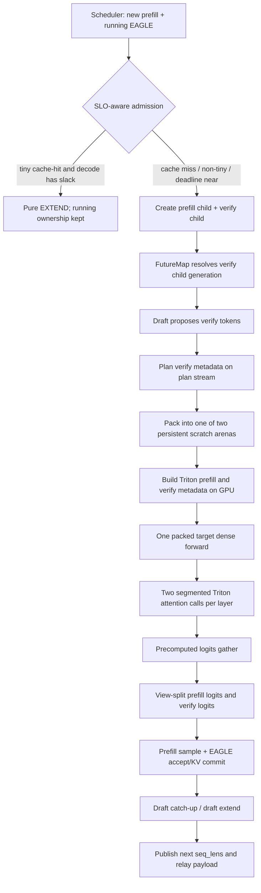

# Mixed+spec 设计与元数据构建说明

日期：2026-08-16
验证配置：Qwen3-4B + Qwen3-4B-Eagle3，RTX 4090，target/draft Triton attention，EAGLE3 `steps=3/topk=1/draft_tokens=4`，chunk size 512，overlap 开启。

## 1. 目标和硬约束

这个实现只改变“prefill 与 EAGLE target verify 同时有工作”的组合轮次。普通 prefill、普通 `TARGET_VERIFY`、draft decode/extend、采样和 KV commit 的原有路径继续存在。

必须维持的约束如下：

1. Triton backend 不因 `seq_lens_cpu` 产生 GPU→CPU 同步；ragged 实际长度由 GPU 上的 `kv_indptr` 表示。
2. `FutureMap` 不新增 steady-state host synchronization。时序正确性用 producer event、generation/producer ticket 和 child-first resolve 表达，不用 `.item()` 或 CPU fence 修补。
3. 普通 EAGLE 不分配 relay ticket，不改变 `TARGET_VERIFY` 的 `qo_indptr` buffer、dtype 或所有权。
4. Mixed 只在明确支持的窄配置开启；未审计的 LoRA、MM、encoder、multi-layer EAGLE 和多卡配置自动 fallback。
5. packed target buffer 在两个 in-flight scratch arena 间轮转，下一轮不能覆盖上一轮仍被 GPU 使用的 tensor。
6. prefix-cache tiny suffix 的 admission 以 decode slack 为准：有 slack 时先完成 pure prefill；接近 decode deadline 时才 Mixed。

## 2. 配置 gate 与 fallback

Mixed EAGLE 仅在以下条件全部成立时开启：

- algorithm 为 EAGLE/EAGLE3；
- `topk=1`；
- target attention backend 为 Triton；
- TP/PP/DP 均为 1；
- single-layer EAGLE；
- 无 LoRA；
- 非 multimodal；
- 非 encoder-decoder。

任一条件不满足会把 `enable_mixed_chunk` 置回 false，并走原有 separated EAGLE。backend 内还有二次 capability check：固定 verify width、DCP=1、无 sliding window、无 deterministic-attention 特殊模式。这个双 gate 防止调度器允许了组合批次、backend 却无法正确解释 metadata。

## 3. 一轮 Mixed+spec 的完整流程



### 3.1 Scheduler admission

Scheduler 先构造正常 `EXTEND` batch，再检查是否存在 running decode。对 EAGLE Mixed：

- cache miss 直接允许 Mixed；
- cache hit 但最大 suffix 大于 4，或 batch suffix 总量较大，允许 Mixed；
- tiny suffix（单请求不超过 4 token，总量不超过 `max(8, 2*new_bs)`）使用 EWMA decode service time 计算 deadline；
- 没有 service sample 或仍有 decode slack 时，pure prefill 快速结束；否则 Mixed。

拒绝 Mixed 时不会清空 running ownership。下一个 scheduler pass 仍能服务 decode，避免“pure prefill 完成后 running batch 丢失”。

### 3.2 FutureMap 时序与所有权

`mix_with_spec_running()` 先产生两个角色 child：prefill child 和 verify child。上一轮 accepted length 到达时必须先 resolve verify child，再由两个 child 重建 parent view。原因是 shallow copy 后若只重绑 parent `seq_lens`，verify child 会保留上一 generation 的旧 tensor。

CUDA 路径的依赖是：

```text
producer forward writes relay buffers
    -> record publish_ready event
consumer stream waits publish_ready (device-side ordering)
    -> gather new_seq_lens_buf[future_indices]
    -> build current verify metadata
```

没有 `payload_ready` steady-state event。`publish_ready` 只位于真实 producer boundary，CUDA 上调用 event wait，不阻塞 host。Triton 所需的三个 backend（target、draft、draft-extend）都声明 `needs_cpu_seq_lens=False` 时，consumer 只保留 GPU gather，并把 `seq_lens_cpu/seq_lens_sum` 设为 `None`；因此不会进入 pinned D2H stream 的 `synchronize()` 分支。

relay generation/producer tickets 只在 Mixed、CI debug 或显式 parity probe 下开启。普通 EAGLE 的四个 CPU ticket array 不分配，也不执行 ticket copy/validation。

### 3.3 Draft plan 与双 in-flight arena

verify child 先执行 draft propose，再在 plan stream 上执行 `eagle_prepare_for_verify(..., allow_cuda_graph=False)`。当前 stream 只在真实 plan-stream producer 边界等待 plan stream。

随后选择 `scratch[cursor]`，cursor 在两个 grow-only arena 间轮转。每个 named buffer 的第一维容量按 2 的幂增长，shape/dtype/device 相同且容量足够时复用。两槽对应 overlap 仍可能在飞的两个 forward generation，避免复用同一 storage 造成 WAR 覆盖。

核心 packed 字段包括：

| 字段 | 构建方式 | 所有权/寿命 |
|---|---|---|
| `input_ids` | `_foreach_copy_([prefill, verify])` | scratch slot，覆盖一轮 target |
| `req_pool_indices` | 同上 | scratch slot |
| `seq_lens` | 同上 | scratch slot |
| `out_cache_loc` | 同上 | scratch slot |
| `positions` | 同上 | scratch slot |
| `extend_seq_lens` | prefill lens + fixed verify width | scratch slot |
| `extend_prefix_lens` | prefill prefix + `verify_seq_len-width` | scratch slot |
| `extend_start_loc` | GPU `cumsum` | scratch slot |
| logits gather indices | prefill last rows + 全部 verify rows | pack/plan 阶段预计算 |

`torch.cat` 不再用于核心 packed token/request metadata。trace 中仍可看到每个 Mixed step 一个 post-model `aten::cat`，来自 accepted `seq_lens` 的 publish/parent rebuild，不在 pre-model pack critical section；这是后续可清理项，不是当前 CPU 或 H2D 瓶颈。

### 3.4 Triton metadata

`ForwardComposition` 保存两个 non-owning segment view，而 parent `ForwardBatch` 只描述 packed dense token 轴。Triton 为两个 segment 分别构造已有且已验证的 metadata：

```text
CompositePrefillVerifyMetadata
  prefill -> EXTEND metadata
  verify  -> TARGET_VERIFY metadata
```

每段 scratch 的 `kv_indices` capacity 使用 host 已知上界：

```text
segment_batch_size * max_context_len
```

GPU ragged builder 写出真实 `kv_indptr`，attention kernel 只消费 `kv_indptr[-1]` 所描述的有效区间。这里没有 `seq_lens.sum().item()`，也不需要把实际 KV 数量搬回 CPU。容量可能保守，但 slot 只增长并跨轮复用。

普通 `TARGET_VERIFY` 没有 composition scratch 时继续执行原路径：独立 `torch.arange(..., dtype=int32, device=cuda)` 创建 `qo_indptr`。只有 composition metadata 才把 arange 写入 caller-owned scratch，避免改变普通路径的 buffer lifetime/aliasing。

每一 transformer layer 的顺序是：packed dense projections → prefill segment Triton attention → verify segment Triton attention → 将两个 segment 输出写回 packed output。两个 attention 调用复用原 EXTEND/TARGET_VERIFY 语义，没有构造统一的大 mask。

### 3.5 logits、sample、accept 与 commit

logits gather indices 在 pack 阶段生成：

- prefill：每个 request 的最后一个 extend token row；
- verify：packed token 轴上全部 verify rows。

LM head 只计算 `prefill_bs + verify_tokens` 行。结果通过 view 切分，不复制 logits/hidden states：

- prefill logits 进入原 sample；
- verify logits 进入原 EAGLE accept；
- prefill KV 按实际 chunk commit；
- verify KV 只按 accepted path commit；
- draft worker 按 accepted tokens catch-up 后发布下一 generation payload。

## 4. 为什么没有新增同步

正确性依赖由“谁生产、谁消费、哪一 generation”表达：

- `publish_ready`：GPU producer→consumer 的 stream ordering；
- plan stream wait：只在 verify metadata 的真实 producer boundary；
- child-first resolve：修复 tensor identity/时序，不等待 GPU；
- relay ticket：CPU 侧 ABA 诊断，只在 Mixed/debug/parity；
- 双 arena：用 storage generation 隔离避免 overwrite。

禁止用来修复正确性的手段包括 `.item()`、`torch.cuda.synchronize()`、在 `FutureMap` 增加新的 payload-ready host fence。profiler 的 42 个 Mixed step（hit 5 + miss 37）中 `aten::item`、`aten::_local_scalar_dense` 和所有 CUDA synchronize API 均为 0。

## 5. 普通路径隔离

关闭 Mixed 或本轮未 admission 时：

- 不构造 `ForwardComposition`；
- 不进入双 scratch pack；
- 不创建 Mixed relay tickets；
- `TARGET_VERIFY` 使用原独立 int32 `qo_indptr`；
- target/draft CUDA Graph fast path 保持可用。

同 workload 的 profiler A/B 中，`TARGET_VERIFY bs=4` p50 为 Mixed-enabled 1.370 ms、Mixed-disabled 1.375 ms；差值 -0.35%，在噪声内，未观察到普通 EAGLE 回退。

## 6. 已知边界与下一步

1. 当前只支持上述 Triton 单卡窄配置。LoRA/MM/encoder、多卡、sliding-window 和 multi-layer EAGLE 必须先补齐 metadata/ownership 测试再放 gate。
2. strict batch-invariant 下，自然语料 20/20 一致；均匀随机 token stress 的 cache-miss `ctx512/bs8` 在第 16 个输出 token 稳定分叉，而同 case 的 separated EAGLE 3/3 一致。它不涉及同步或 relay generation 错位，但阻止我们宣称所有输入 bitwise invariant。下一步应对该 case 开 operator parity，检查 fork token 的 top-2 margin，并按层定位 composed dense 或 segmented attention 的首个数值差异；修复仍应调整算子 shape/时序，不应增加同步。
3. pre-model metadata 只占约 1.0–1.5 ms且已被 GPU 覆盖。下一轮优化应优先攻击 prefix-hit 的长上下文 Triton attention，以及 cache-miss 的 dense GEMM，而不是继续微调 CPU pack。
